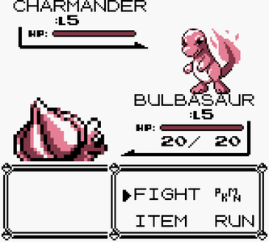

# Turn Based RPG Combat System

## What?

**The idea is pretty simple:** Develop a simple combat system similar to Pokemon (Turn Based Style).

Like this:

**Second Idea:** I want it to have some kind of an API where it is relatively simple to develop an AI that can come up with strategies to play this kind of game.

I worked on one AI like this on my graduation and I want to develop a simple testbed game for it now.

## Why?

1. Because I want to.
2. Because I've been thinking on this pet project for a while and it seems not that complex to build.
3. Because I want to write some kind of playable open source thing with an API.
4. Because I want learn and practice with Data Oriented Design, and this project is the first one I will build thinking on DOP from Day 0.
5. C++ Practice.

## How?

1. Plain C++ (and maybe in the future SDL or any other library so I can create windows and render images on screen)
2. Data Oriented Design
3. The rest is pretty much on the source code, go check it out (unless the project is on a very early phase)

