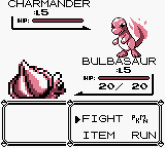

# Turn Based RPG Combat System

## What?

**The idea is pretty simple:** Develop a simple combat system similar to Pokemon (Turn Based Style).

Like this:

**Second Idea:** I want it to have some kind of an API where it is relatively simple to develop an AI that can come up with strategies to play this kind of game.

I worked on one AI like this on my graduation and I want to develop a simple testbed game for it now.

## Why?

1. Because I want to.
2. Because I've been thinking on this pet project for a while and it seems not that complex to build.
3. Because I want to write some kind of playable open source thing with an API.
4. Because I want learn and practice with Data Oriented Design, and this project is the first one I will build thinking on DOP from Day 0.
5. C++ Practice.

## How?

1. Plain C++ (and maybe in the future SDL or any other library so I can create windows and render images on screen)
2. Data Oriented Design
3. The rest is pretty much on the source code, go check it out (unless the project is on a very early phase)

### Data Considerations
1. I will want to read both Pokemon's speed sequentially. The same applies to the level.
2. When acessing a pokemon attack or special attack, I will be acessing the other pokemon defense or special defense.
3. When acessing a certain move, I will mostly need it's type, PP, power and accuracy.
4. If I can manage to have both Pokemon on cache, it would be wonderful (no idea what I'm talking about here).
5. Maybe this is not a project I should be worrying about data oriented programming.

--------

## Pokemon Information

Each Pokemon has the following Base Stats:

* HP
* Attack
* Defense
* Special Attack
* Special Defense
* Speed

And the following Information:
* Level

[Source](https://bulbapedia.bulbagarden.net/wiki/List_of_Pokémon_by_base_stats_(Generation_VII-present))

-------------------------

## Moves

Each Pokemon Move consists of:

* ID
* Name
* Type
* Category
* Contest
* PP
* Power
* Accuracy

[Source](https://bulbapedia.bulbagarden.net/wiki/List_of_moves)

-------------------------

## Battle Rules

Oh well, let's go...

On Pokemon Battle, there are a set of rules that happens on a battle.

1. At least 1 PP is required to perform a move.
2. Both sides select their moves beforehand.
3. The Pokemon with the highest speed moves first, except if Trick Room is in effect or Quick Attack was the chosen movement (not that it will matter on this implementation).
4. If a Pokemon's HP reaches 0, it faints and loses the battle.

-------------------------

## Damage Calculation [Source]()

**A** is the effective attack stat of the Pokemon attacking (Attack or Special Attack).

**D** is the effective defense of the Pokemon defending (Defense or Special Defense).

**Power** is, well, the power of the move.

**About the modifier...**

**Target:** *n/a*

**Weather:** *n/a*

**Badge:** *n/a*

**Critical:** **1.5** for a critical hit (Generation IV onwards), **1** otherwise. A critical hit on this implementation assumes *always* stage 0 on the critical hit chance table from Gen II onwards, this table can be seen [here](https://bulbapedia.bulbagarden.net/wiki/Critical_hit) - In other words, *P(critical) =  6.25%*

**Random:** a random factor between 0.85 and 1 (inclusive).

**STAB:** *n/a*

**Type:** [*type effectiveness*](https://bulbapedia.bulbagarden.net/wiki/Type), can be **0** (not effective); **0.25**, **0.5** (not very effective); **1** (normally effective); **2** or **4** (super effective) - it depends on the move's and target types.

**Burn:** *n/a*

**Other:** *n/a*

Every attribute with a *n/a* has a different purpose and meaning on original Pokemon, but as I am going to simplify it I won't be using them, so essentially all these values are 1.

-------------------------

**That's it for starters :)**